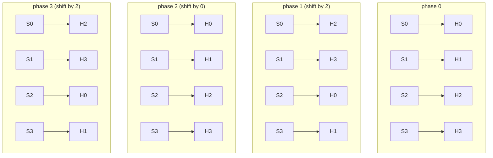
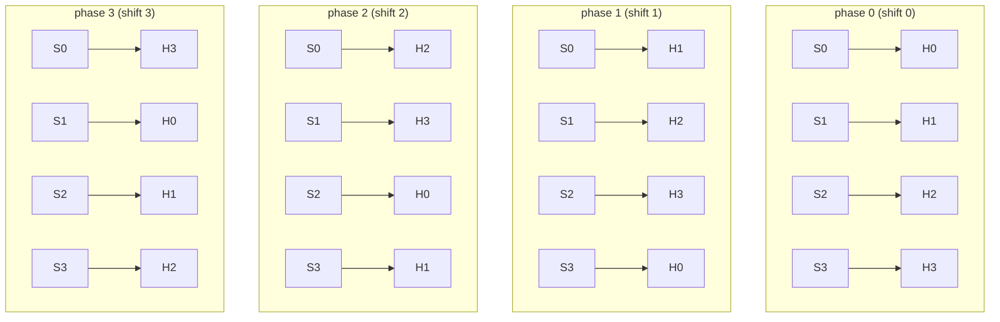

# MORPHER: Multi-scale Organized Recurrent Parallel Hypothesis Execution for Reasoning

> **Note on math rendering (GitHub):** this document uses GitHub-flavored Markdown math delimiters: inline `$...$` and block `$$...$$`.

## Abstract
We introduce **MORPHER**, a recurrent Transformer-like architecture for iterative (“System-2”) reasoning. MORPHER is designed to increase **effective computational depth** without increasing parameters proportionally. It does so by (i) **reusing parameters across recurrent depth steps**, (ii) introducing **multi-timescale state** whose components update at different frequencies *along the computation axis* (depth-through-time, not across tokens), and (iii) maintaining **parallel streams** that can represent phase-shifted internal clocks or parallel hypotheses. MORPHER provides a clean substrate for studying longer-horizon iterative computation and structured memory, while remaining compatible with modern attention primitives and GPU-efficient execution.

---

## 1. Motivation

### 1.1 Iteration helps, but naive recurrence can saturate
Many reasoning tasks benefit from multiple rounds of computation over a fixed input: re-reading, refining intermediate beliefs, and converging to a stable answer. Deep feed-forward Transformers can approximate iterative computation by stacking layers, but this directly scales parameters and often couples “thinking depth” to model size.

A natural alternative is **recurrence**: repeatedly apply the same transformation, reusing parameters. Recurrence offers a tunable compute knob at inference (run more steps when needed) and can reduce parameter count for a given compute budget. However, recurrent Transformers can **saturate** quickly: repeated application of the same block may converge toward a regime where additional steps add diminishing returns.

MORPHER is motivated by the hypothesis that **multi-timescale state updates along the recurrent depth axis** can slow saturation and yield a larger “useful step budget” before convergence.

### 1.2 Multi-timescales are along *depth*, not along tokens
In MORPHER, “multiple timescales” refers to how internal state evolves over **recurrent depth steps**, not to dynamics over token positions. The sequence length $T$ is fixed; attention is computed over tokens as usual. The timescales govern **which parts of latent state are allowed to change at which depth frequencies** as the recurrent computation unfolds.

This is central: MORPHER aims to create a model that can perform **deeper computation with fewer parameters**, biasing learning toward reusable procedures and more abstract representations encoded in *state trajectories* rather than memorized in parameter-rich depth.

### 1.3 Parameters vs compute vs memory (a deliberate trade)
There is a practical tradeoff between allocating capacity to parameters (larger networks) versus allocating capacity to compute (more iterative steps) and state (memory). MORPHER intentionally moves along this frontier: it trades parameter growth for **recurrent depth**, and structures memory so the model can preserve slow variables across many steps.

---

## 2. Overview of MORPHER
MORPHER maintains a latent state organized as:

1. **Parallel streams**: multiple recurrent traces (hypotheses or phase-shifted clocks),
2. **Multi-timescale slots** within each stream: fast and slow state components,
3. A **scheduled update rule**: at each micro-step, only a small subset of slots are updated.

Each micro-step consists of:
- a **global mixing** operation that can exchange information across the full state, followed by
- a **selective attention update** that writes *only* into the scheduled active slots.

The result is a structured recurrent dynamical system with explicit fast and slow variables.

---

## 3. State space and multi-timescale structure

Let:
- batch size $B$, sequence length $T$,
- number of streams $N$,
- slot width $d$,
- timescales $\{s_1, s_2, \dots, s_K\}$ with $s_1=1$.

### 3.1 Streams and slots
Each stream’s state is a concatenation of **slots**:
- For each timescale $s_k$, allocate $s_k$ slots.
- Total slots per stream:

$$
S = \sum_{k=1}^{K} s_k.
$$

- Stream state dimension:

$$
D = S \cdot d.
$$

Latent state at micro-step $t$:

$$
z_t \in \mathbb{R}^{B \times T \times N \times D}.
$$

Equivalently as slots:

$$
z_t \equiv [z_t^{(1)}, \dots, z_t^{(S)}], 
\qquad 
z_t^{(j)} \in \mathbb{R}^{B \times T \times N \times d}.
$$

### 3.2 Periodicity and phase
Define the schedule period:

$$
N = \mathrm{lcm}(s_1, s_2, \dots, s_K),
$$

and interpret $N$ as both:
- the number of parallel streams, and
- the phase period of the update schedule.

Each micro-step has phase:

$$
\phi(t)=t \bmod N.
$$

---

## 4. Scheduled updates: fast and slow variables over depth

At each phase $\phi$, MORPHER updates exactly **one slot per timescale** in each stream. Fast scales update frequently; slow scales update rarely, creating long-lived state components.

Let $\mathrm{offset}(k)$ be the starting slot index for scale $s_k$. The scheduled slot for scale $k$ at phase $\phi$ is:

$$
a(\phi,k)=\mathrm{offset}(k) + (\phi \bmod s_k).
$$

The active set at phase $\phi$ is:

$$
A_\phi=\{a(\phi,1), \dots, a(\phi,K)\}.
$$

**Key property.** At each micro-step, MORPHER updates only the slots in $A_\phi$ and leaves all other slots unchanged. Thus slow variables are explicitly protected from being overwritten at every step.

---

## 5. MORPHER micro-step dynamics

A micro-step updates $z_t \mapsto z_{t+1}$ with two conceptual stages.

### 5.1 Global mixing (slot interaction)
First, a global mixing operator enables interaction across the entire stream state:

$$
\tilde{z}_t = z_t + \mathcal{M}(z_t),
$$

where $\mathcal{M}$ is a learned nonlinear map (e.g., normalized MLP). This stage allows “communication” across slots.

### 5.2 Selective scheduled write
Second, apply a learned update operator $\mathcal{U}_\phi$ only to active slots:

$$
z_{t+1}^{(j)}=
\begin{cases}
\tilde{z}_t^{(j)} + \mathcal{U}_\phi(\tilde{z}_t)^{(j)}, & j\in A_\phi,\\
\tilde{z}_t^{(j)}, & j\notin A_\phi.
\end{cases}
$$

This makes the multi-timescale semantics explicit: state components evolve at different rates **along recurrent depth**.

---

## 6. Attention as the selective update operator

In MORPHER, $\mathcal{U}_\phi$ is implemented using attention computed over the sequence dimension $T$, but routed to write only into the scheduled active slots.

### 6.1 Read scope
A key design choice is what information a head reads from when forming queries/keys/values:

- **Slot-local**: read only the active slot (maximizes “frozen slot” purity).
- **Active-scales**: read concatenation of all active slots across scales.
- **Full-stream**: read the full stream state (most Transformer-like).

These choices trade off strict timescale separation against richer conditioning per update.

### 6.2 Parallel streams and hypothesis execution
Parallel streams can be interpreted as simultaneous recurrent traces. MORPHER includes wiring schemes that either:
- keep stream/head association fixed (encouraging per-stream specialization), or
- permute associations across phases (encouraging structured parameter sharing and cross-stream coverage).

---

## 7. Recurrence, effective depth, and why multi-timescales may help

MORPHER can be run for multiple cycles, applying the micro-step map repeatedly:

$$
z_{t+R} = F^{(R)}(z_t; x),
$$

where $F$ is the MORPHER micro-step transformation conditioned on input $x$.

**Hypothesis.** Multi-timescale slots mitigate recurrent saturation because the system cannot collapse entirely into a single rapidly convergent regime: slow variables update sparsely and preserve longer-horizon commitments, enabling productive computation over more steps and increasing effective depth.

---

## 8. Worked visualization: schedules and head sharing for $[1,2,4]$

This section is intended to let the reader **see** MORPHER’s organization of:
- multi-timescale slot updates along recurrent depth,
- parallel streams, and
- structured head reuse (PRIVATE vs SHARED wiring).

We use:

$$
\text{time\_scales}=[1,2,4],\quad K=3,\quad S=7,\quad N=\mathrm{lcm}(1,2,4)=4.
$$

Thus a **cycle** has 4 phases $\phi\in\{0,1,2,3\}$, and the schedule repeats every 4 micro-steps.

### 8.1 Slot layout within each stream
Slots are allocated contiguously by scale:
- scale $s=1$: slot indices $[0]$
- scale $s=2$: slot indices $[1,2]$
- scale $s=4$: slot indices $[3,4,5,6]$

We will denote these as:

$$
\underbrace{[0]}_{s=1}\;\;\underbrace{[1,2]}_{s=2}\;\;\underbrace{[3,4,5,6]}_{s=4}.
$$

### 8.2 Active slot schedule over one cycle
The active slot for each scale at phase $\phi$ is $a(\phi,s)=\mathrm{offset}(s)+(\phi \bmod s)$.

| phase | active slot for $s=1$ | active slot for $s=2$ | active slot for $s=4$ |
|---:|---:|---:|---:|
| 0 | 0 | 1 | 3 |
| 1 | 0 | 2 | 4 |
| 2 | 0 | 1 | 5 |
| 3 | 0 | 2 | 6 |

#### Timeline (“● updated / — frozen”)
> This is a pure schedule view: it shows *which* state components can change at each depth step.

```
phase:        0   1   2   3
------------------------------
s=1  slot0:   ●   ●   ●   ●

s=2  slot1:   ●   —   ●   —
s=2  slot2:   —   ●   —   ●

s=4  slot3:   ●   —   —   —
s=4  slot4:   —   ●   —   —
s=4  slot5:   —   —   ●   —
s=4  slot6:   —   —   —   ●
```

**Interpretation.**
- There is always a “fast scratch” component (slot 0) updated every micro-step.
- Medium variables alternate between two slots.
- Slow variables update one-at-a-time, persisting across many steps.

This multi-timescale structure is explicitly along the **recurrent depth axis**.

---

## 9. Head assignment: PRIVATE vs SHARED (how compute is reused)

MORPHER conceptually uses $N$ heads per scale, for $H=K\cdot N$ heads total.
We index heads by (scale $k$, within-scale head $n$) and map to a global id:

$$
\mathrm{gid}(k,n)=k\cdot N + n.
$$

For $[1,2,4]$ with $N=4$, global head ids are:
- scale $s=1$ ($k=0$): heads 0–3
- scale $s=2$ ($k=1$): heads 4–7
- scale $s=4$ ($k=2$): heads 8–11

### 9.1 PRIVATE wiring
PRIVATE keeps stream/head association fixed:

$$
\text{head}(k,\phi,\text{stream }n)=n.
$$

So stream $n$ always uses the same within-scale head $n$ for that scale (no permutation across phases).

### 9.2 SHARED wiring (phase-permuted within each scale)
SHARED uses a phase-dependent permutation:

$$
j_k(\phi)=\phi \bmod s_k,\qquad \alpha_k=\frac{N}{s_k},
$$

$$
\text{head}(k,\phi,n)=(n+\alpha_k\cdot j_k(\phi))\bmod N.
$$

**Intuition.**
- $s=1$: never permutes (because $\phi \bmod 1 = 0$).
- $s=2$: alternates between two permutations (shift by 0 or shift by 2).
- $s=4$: rotates by one each phase (shift by $\phi$).

This creates a hierarchy of sharing rhythms that mirrors the timescales.

---

## 10. A “see it” figure: SHARED wiring across streams and phases (Mermaid)

GitHub renders Mermaid diagrams. The figure below shows SHARED wiring for each scale over phases $\phi=0,1,2,3$.
Each arrow means: “stream $n$ uses head $m$ (within this scale) at this phase”.

> **Scale $s=2$** (within-scale heads $H0..H3$), phase-dependent permutation:



> **Scale $s=4$** rotates every phase (shift by $\phi$):



These diagrams show the key effect of SHARED wiring: the *same* head parameters are reused across streams across phases, but routing remains structured and invertible.

---

## 11. Combined view: slots × heads (what actually happens at a micro-step)

At phase $\phi$, for each stream $n$ and each scale $s_k$:

1. the schedule selects the active slot index $a(\phi,k)$,
2. the wiring selects a within-scale head $\text{head}(k,\phi,n)$,
3. attention produces an update that is **written only** into that active slot.

For $[1,2,4]$, the active slots per phase are:

| phase | active slots (s=1, s=2, s=4) |
|---:|:---|
| 0 | (0, 1, 3) |
| 1 | (0, 2, 4) |
| 2 | (0, 1, 5) |
| 3 | (0, 2, 6) |

And SHARED head usage (global ids) per stream for each phase is:

| phase | stream 0 | stream 1 | stream 2 | stream 3 |
|---:|:---|:---|:---|:---|
| 0 | (0,4,8)   | (1,5,9)   | (2,6,10) | (3,7,11) |
| 1 | (0,6,9)   | (1,7,10)  | (2,4,11) | (3,5,8)  |
| 2 | (0,4,10)  | (1,5,11)  | (2,6,8)  | (3,7,9)  |
| 3 | (0,6,11)  | (1,7,8)   | (2,4,9)  | (3,5,10) |

**Reading this table.**  
For example, at phase 1:
- every stream updates slots $(0,2,4)$,
- stream 0 uses heads $(0,6,9)$ for scales $(1,2,4)$,
- stream 3 uses heads $(3,5,8)$, etc.

This is MORPHER’s core organization: **multi-timescale updates along depth** combined with **structured head reuse across streams**, enabling deeper computation without proliferating parameters.

---

## 12. Summary (intended benefits)
MORPHER is a structured recurrent architecture designed to support iterative reasoning with:

- **Depth through time:** deeper computation via recurrence rather than parameter-heavy stacking.
- **Multi-timescale state along depth:** explicit fast/slow variables updating at different rates.
- **Parallel streams:** structured diversity for hypothesis execution or phase-shifted computation.
- **Structured head reuse:** shared compute across streams/phases with invertible routing.

The central objective is to explore whether **parameter-efficient depth**, implemented as recurrent multi-timescale dynamics, encourages more procedural and abstract representations and yields more useful iterative computation before saturation.
